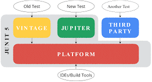
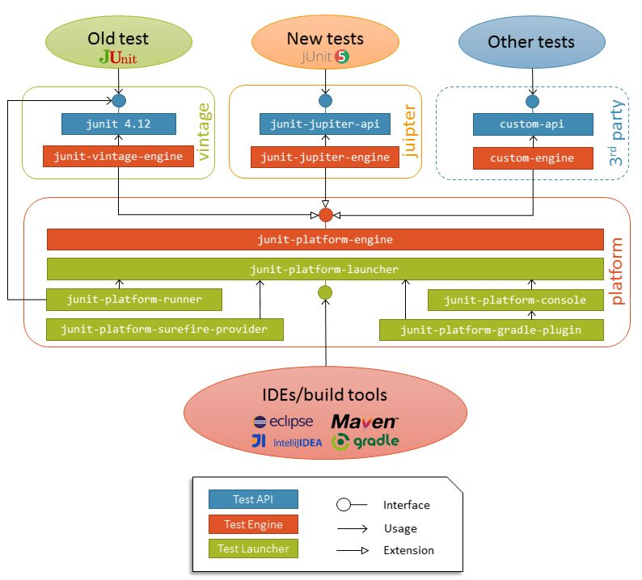

#Migration Junit-4 to Junit-5

## Difference between Junit4/5
1. **Junit 4: Single bundled jar**

2. **Junit 5: It consists of platform, jupiter and vintage library**

    **Architecture -**
    
    - Basic: 

    - Detailed: 

    **Junit Platform -** which serves as a foundation for launching testing frameworks on the JVM (Java Virtual Machine), also provides an API to launch tests from either the console, IDEs, or build tools.

    1. **`junit-platform-commons -`** an internal common library of JUnit, intended solely for usage within the JUnit framework itself. Any usage by external parties isn’t supported.

    2.  **`junit-platform-console -`** which provides support for discovering and executing tests on the JUnit Platform from the console.

    3. **`junit-platform-console-standalone -`** an executable JAR with all dependencies included. It’s used by Console Launcher, a command-line Java application that lets you launch the JUnit Platform from the console. For example, it can be used to run JUnit Vintage and JUnit Jupiter tests and print test execution results to the console.

    4. **`junit-platform-engine -`** a public API for test engines.

    5. **`junit-platform-launcher -`** a public API for configuring and launching test plans, typically used by IDEs and build tools.

    6. **`junit-platform-runner -`** a runner for executing tests and test suites on the JUnit Platform in a JUnit 4 environment.

    7. **`junit-platform-suite-api -`** which contains the annotations for configuring test suites on the JUnit Platform.

    8. **`junit-platform-surefire-provider -`** which provides support for discovering and executing tests on the JUnit Platform using Maven Surefire.

    9. **`junit-platform-gradle-plugin -`** which provides support for discovering and executing tests on the JUnit Platform using Gradle.


    **Junit Jupiter -** combination of the new programming model and extension model for writing tests and extensions.

    1. **`junit-jupiter-api -`** the JUnit Jupiter API for writing tests and extensions.

    2. **`junit-jupiter-engine -`** the JUnit Jupiter test engine implementation, only required at runtime.

    3. **`junit-jupiter-params -`** which provides support for parameterized tests in JUnit Jupiter.

    4. **`junit-jupiter-migrationsupport -`** which provides migration support from JUnit 4 to JUnit Jupiter, and it’s required only for running selected JUnit 4 rules.

    **Junit Vintage-** a test engine for running JUnit 3 and JUnit 4 based tests on the platform, ensuring the necessary backwards compatibility.

## Mockito version upgrade in the `pom.xml` file for **`Maven build`**

Add junit 5 dependencies and for mocking add mockito-junit-jupiter. In case of mocking **static/final/constructor** then add mockito-inline dependency.

```
<dependency>
    <groupId>org.mockito</groupId>
    <artifactId>mockito-junit-jupiter</artifactId>
    <version>${mockito-junit-jupiter.version}</version>
    <scope>test</scope>
</dependency>
```

```
<dependency>
    <groupId>org.mockito</groupId>
    <artifactId>mockito-junit-jupiter</artifactId>
    <version>${mockito-junit-jupiter}</version>
    <scope>test</scope>
</dependency>
```


## Handy annotations used for writing unit tests

1. **[`@Spy`](https://www.javadoc.io/doc/org.mockito/mockito-core/latest/org/mockito/Spy.html) -** Spy annotation is used to create a real object and spy on that real object. This would help to call all the object methods while still tracking every interaction that is being mocked.

2. **[`@Mock`](https://www.javadoc.io/doc/org.mockito/mockito-core/latest/org/mockito/Mock.html)**

    1. Different ways to create Mock:
        - Using `@Mock` annotation
        - Using `Mock()` method

3. **[`@RunWith`](https://junit.org/junit4/javadoc/4.13/org/junit/runner/RunWith.html)[`(MockitoJUnitRunner.class)`](https://www.javadoc.io/doc/org.mockito/mockito-core/latest/org/mockito/junit/MockitoJUnitRunner.html) -** We can run JUnit 5 tests with any older JUnit environment using the `@RunWith` annotation. Initializes mocks annotated with Mock, so that explicit usage of ```MockitoAnnotations.initMocks(Object)``` is not necessary. Mocks are initialized before each test method. the `@RunWith` annotation has been replaced by the more powerful `@ExtendWith` annotation.

4. **[`@Captor`](https://www.javadoc.io/doc/org.mockito/mockito-core/latest/org/mockito/Captor.html)**

5. **[`@InjectMock`](https://www.javadoc.io/doc/org.mockito/mockito-core/latest/org/mockito/InjectMocks.html) -** InjectMocks annotation is used to mock a class with all its dependencies.


## Maven plugin surefire
- It Can run the tests of a project using the surefire plugin. 
- By default, this plugin generates XML reports in the directory target/surefire-reports. 
- This plugin has only one goal, test. This goal is bound to the test phase of the default build lifecycle, and the command mvn test will execute it.

## Powermock
Enable mocking of static methods, constructors, final classes and methods, private methods, removal of static initializers. **(avoid using it, if possible)** Reference- https://www.baeldung.com/intro-to-powermock

## Migration tip refrence document
- https://junit.org/junit5/docs/current/user-guide/#migrating-from-junit4-tips

## Other references
- https://freecontent.manning.com/junit-5-architecture/#:~:text=JUnit%205%20modularity&text=Its%20architecture%20had%20to%20allow,discovering%20and%20running%20the%20tests.
- https://blogs.oracle.com/javamagazine/post/migrating-from-junit-4-to-junit-5-important-differences-and-benefits