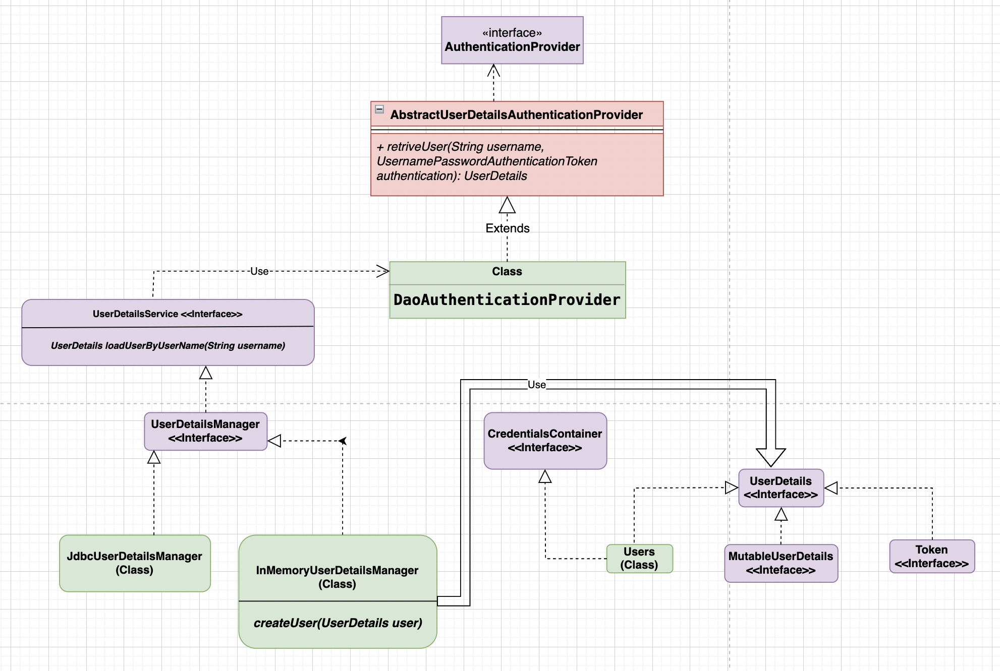
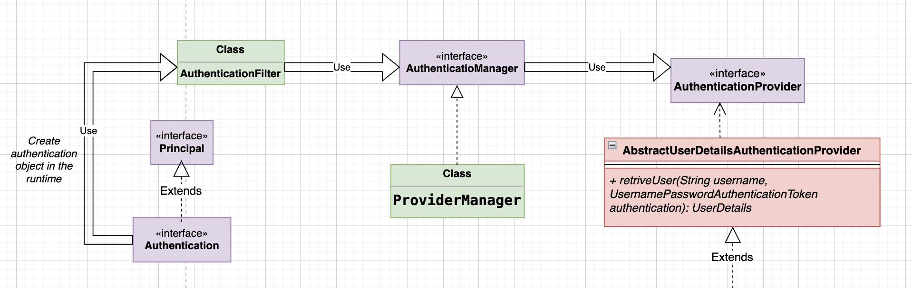
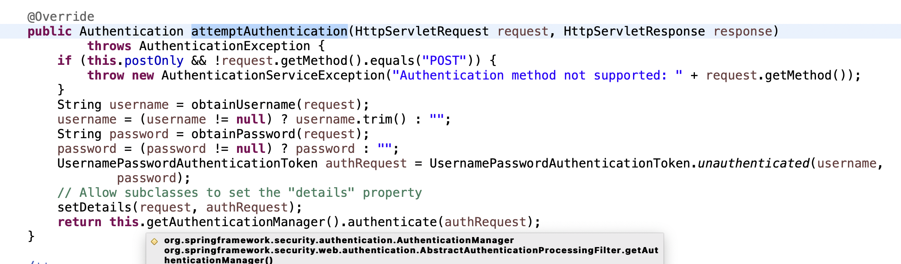
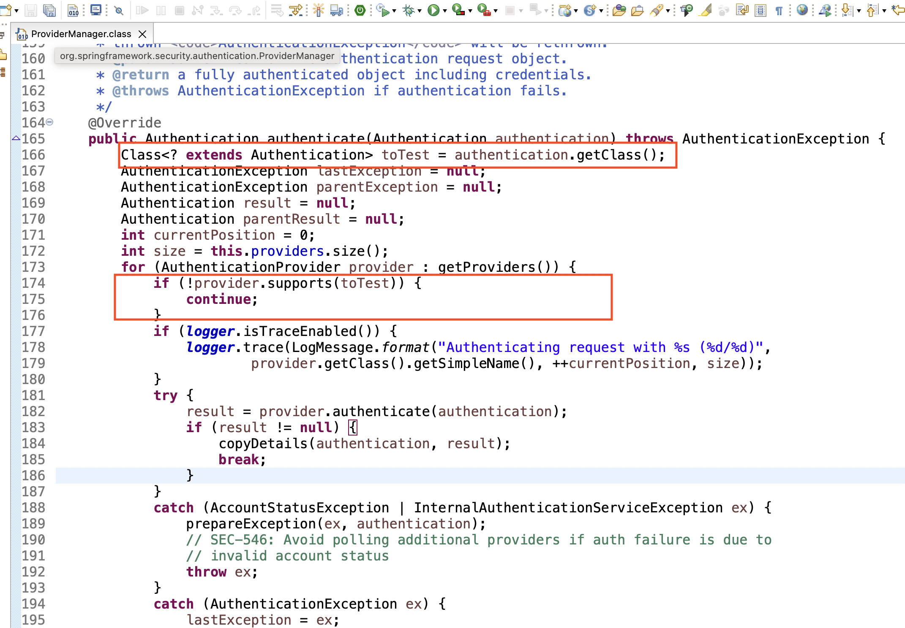
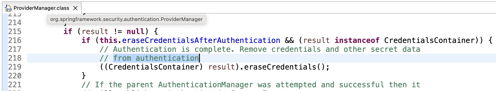
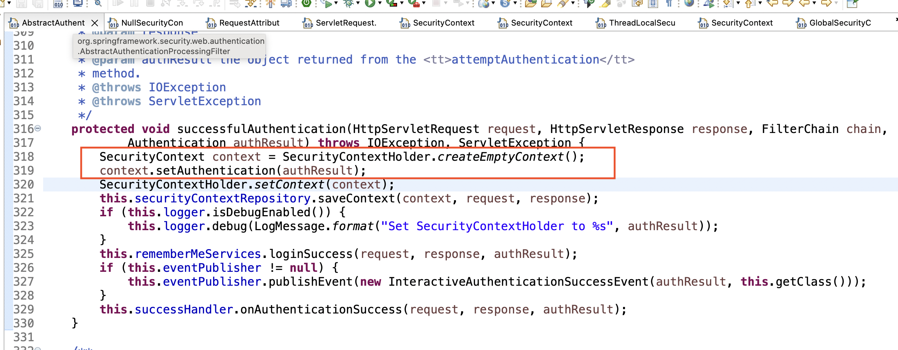
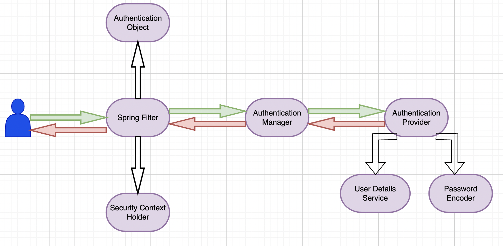

# Spring Security in detail

## Initial step:

### Steps to configure web MVC by adding dependencies explicitly without Spring Boot auto-configure -
1. Add dependencies
    - [spring-webmvc](https://mvnrepository.com/search?q=spring-webmvc)
    - [javax.servlet-api](https://mvnrepository.com/search?q=javax.servlet-api)

2. Extend [AbstractAnnotationConfigDispatcherServletInitializer](https://docs.spring.io/spring-framework/docs/current/javadoc-api/org/springframework/web/servlet/support/AbstractAnnotationConfigDispatcherServletInitializer.html), then add implementation for all the methods -
    - Provide a configuration class for the getServletConfigClasses method with the custom config class.
    - Provide URL mapping for the getServletMapping method.

3. In the custom config class should be marked with [@Configuration](https://docs.spring.io/spring-framework/docs/current/javadoc-api/org/springframework/context/annotation/Configuration.html), [@EnableWebMvc](https://docs.spring.io/spring-framework/docs/current/javadoc-api/org/springframework/web/servlet/config/annotation/EnableWebMvc.html) and [@ComponentScan](https://docs.spring.io/spring-framework/docs/current/javadoc-api/org/springframework/context/annotation/ComponentScan.html) annotations. Also, this class should create a bean for the view resolver if the view page exists in the project folder location. (create [InternalResourceViewresolver](https://docs.spring.io/spring-framework/docs/current/javadoc-api/org/springframework/web/servlet/view/InternalResourceViewResolver.html) bean).


### Adding Spring Security -

Before the dispatcher dispatches the request Spring security filter comes in the action to filter the requests. It is just a simple servlet filter.
1. Add dependencies
    - [spring-security-config](https://mvnrepository.com/artifact/org.springframework.security/spring-security-config)
    - [spring-security-web](https://mvnrepository.com/artifact/org.springframework.security/spring-security-web)

2. Create a custom web security class for your application by extending [WebSecurityConfigurerAdapter](https://docs.spring.io/spring-security/site/docs/current/api/org/springframework/security/config/annotation/web/configuration/WebSecurityConfigurerAdapter.html) and mark this class with [@EnableWebSecurity](https://docs.spring.io/spring-security/site/docs/4.0.x/apidocs/org/springframework/security/config/annotation/web/configuration/EnableWebSecurity.html), then this custom web security should be attached with Spring security using custom security initializer.

3. To create custom security initializer extend [AbstractSecurityWebApplicationInitializer](https://docs.spring.io/spring-security/site/docs/4.2.4.RELEASE/apidocs/org/springframework/security/web/context/AbstractSecurityWebApplicationInitializer.html)

4. With respect to the custom web security class in the step 2 inherit method [configure(HttpSecurity http)](https://docs.spring.io/spring-security/site/docs/current/api/org/springframework/security/config/annotation/web/configuration/WebSecurityConfigurerAdapter.html#configure(org.springframework.security.config.annotation.web.builders.HttpSecurity)) which contains default behaviour to authenticate form based and rest client. This can be overridden by the custom authentication mechanism. This method is used to configure all the endpoints and authorization.

5. Override [configure(AuthenticationManagerBuilder auth)](https://docs.spring.io/spring-security/site/docs/current/api/org/springframework/security/config/annotation/web/configuration/WebSecurityConfigurerAdapter.html#configure(org.springframework.security.config.annotation.authentication.builders.AuthenticationManagerBuilder)) to authenticate the user based upon requirement, here we can configure different types of authentication such as in-memory/jdbc/ldap etc.

### Note -
- [WebSecurityConfigurerAdapter is dperecated from the spring version 5.7.0-M2](https://spring.io/blog/2022/02/21/spring-security-without-the-websecurityconfigureradapter)

### Spring Security basic architecture

- [UserDetails](https://docs.spring.io/spring-security/site/docs/current/api/org/springframework/security/core/userdetails/UserDetails.html) is an interface that holds the user's details. e.g Name, Id, GrantedAuthority, Account Expiry, Account Locked, Password, etc.

- **`UserDetails`** interface is implemented in the Users class provided by Spring also it implements another interface called [CredentialContainer](https://docs.spring.io/spring-security/site/docs/current/api/org/springframework/security/core/CredentialsContainer.html).

- **`UserDetails`** type is used in the different implementations of [UserDetailsManager](https://docs.spring.io/spring-security/site/docs/current/api/org/springframework/security/provisioning/UserDetailsManager.html) which wraps the user's info.

- There are different types of **`UserDetailsManager`** implementation such as [InMemoryUserDetailsManager](https://docs.spring.io/spring-security/site/docs/current/api/org/springframework/security/provisioning/InMemoryUserDetailsManager.html), and [JdbcUserDetailsManager](https://docs.spring.io/spring-security/site/docs/current/api/org/springframework/security/provisioning/JdbcUserDetailsManager.html) and it can be implemented to define a custom user details manager.

- The **`UserDetailsManager`** interface extends another interface known as [UserDetailsService](https://docs.spring.io/spring-security/site/docs/current/api/org/springframework/security/core/userdetails/UserDetailsService.html), this has only one method [loadUserByUserName(String username)](https://docs.spring.io/spring-security/site/docs/current/api/org/springframework/security/core/userdetails/UserDetailsService.html#loadUserByUsername(java.lang.String)). The same method will be inherited by all the child classes.

- Having **`loadUserByUserName(String username)`** separately in the **`UserDetailsService`** interface makes it easier to create a custom user details manager.

- **`loadUserByUserName(String username)`** is called by different authentication provider. One of the authentication providers is [DaoAuthenticationProvider](https://docs.spring.io/spring-security/site/docs/current/api/org/springframework/security/authentication/dao/DaoAuthenticationProvider.html) which extends [AbstractUserDetailsAuthenticationProvider](https://docs.spring.io/spring-security/site/docs/current/api/org/springframework/security/authentication/dao/AbstractUserDetailsAuthenticationProvider.html).

- **`AbstractUserDetailsAuthenticationProvider`** class implements [AuthenticationProvider](https://docs.spring.io/spring-security/site/docs/current/api/org/springframework/security/authentication/AuthenticationProvider.html) interface which has [authenticate(Authentication authentication)](https://docs.spring.io/spring-security/site/docs/current/api/org/springframework/security/authentication/dao/AbstractUserDetailsAuthenticationProvider.html#authenticate(org.springframework.security.core.Authentication)) method.

- **`AbstractUserDetailsAuthenticationProvider`** provides implementation of [authenticate(Authentication authentication)](https://docs.spring.io/spring-security/site/docs/current/api/org/springframework/security/authentication/dao/AbstractUserDetailsAuthenticationProvider.html#authenticate(org.springframework.security.core.Authentication)) method, which makes calls to the abstract method [retrieveUser(String username, UsernamePassowrdAuthenticationToken authentication)](https://docs.spring.io/spring-security/site/docs/current/api/org/springframework/security/authentication/dao/AbstractUserDetailsAuthenticationProvider.html#retrieveUser(java.lang.String,org.springframework.security.authentication.UsernamePasswordAuthenticationToken)) and this is implemented in one of the concrete classes known as [DaoAuthenticationProvider](https://docs.spring.io/spring-security/site/docs/current/api/org/springframework/security/authentication/dao/DaoAuthenticationProvider.html).



- Custom authentication provider can be introduced by implementing the [AuthenticationProvider](https://docs.spring.io/spring-security/site/docs/current/api/org/springframework/security/authentication/AuthenticationProvider.html) interface.

- [AuthenticationManager](https://docs.spring.io/spring-security/site/docs/current/api/org/springframework/security/authentication/AuthenticationManager.html) interface scan all the authentication provider to authenticate.

- **`AuthenticationManager`** has a couple of implementations; one of the concrete implementations is [ProviderManager](https://docs.spring.io/spring-security/site/docs/current/api/org/springframework/security/authentication/ProviderManager.html).

- [ProviderManager](https://docs.spring.io/spring-security/site/docs/current/api/org/springframework/security/authentication/ProviderManager.html) class implements the [authenticate(Authentication authentication)](https://docs.spring.io/spring-security/site/docs/current/api/org/springframework/security/authentication/ProviderManager.html#authenticate(org.springframework.security.core.Authentication)) method calling the **`AuthenticationProvider`** in the runtime.

- **`AuthenticationManager`** implementation is called by [AuthenticationFilter](https://docs.spring.io/spring-security/site/docs/current/api/org/springframework/security/web/authentication/AuthenticationFilter.html) class which creates an **`Authentication`** object from the HTTP request.

- [Authentication](https://docs.spring.io/spring-security/site/docs/current/api/org/springframework/security/core/Authentication.html) is an interface that extends the [Principal : Java 17](https://docs.oracle.com/en/java/javase/17/docs/api/java.base/java/security/Principal.html) interface.



- Default and form-based authentication create [UsernamePasswordAuthenticationToken](https://docs.spring.io/spring-security/site/docs/current/api/org/springframework/security/authentication/UsernamePasswordAuthenticationToken.html) object which is of the **`Authentication`** type.

- There are different types of Spring-provided filters, one of the filters is [UsernamePasswordAuthenticationFilter](https://docs.spring.io/spring-security/site/docs/current/api/org/springframework/security/web/authentication/UsernamePasswordAuthenticationFilter.html) which makes requests to the implementation of the **`AuthenticationManager`** interface for all the configured **`AuthenticationProvider`** implementations.

- Filters in the spring can be configured in different ways, here are two simple approaches -
    1. Extending the existing Spring provided filter and override the **`doFilterInternal(HttpServletRequest request, HttpServletResponse response, FilterChain chain)`** E.g [OncePerRequestFilter](https://docs.spring.io/spring-framework/docs/current/javadoc-api/org/springframework/web/filter/OncePerRequestFilter.html)
    
    
        ```
        public class CustomFilter extends OncePerRequestFilter {
            @Override
            protected void doFilterInternal(HttpServletRequest request, 
                HttpServletResponse response, FilterChain filterChain)
                throws ServletException, IOException {
                /**
                *  Custom logic can be here.
                */   
                filterChain.doFilter(request, response);
            }
        }
        ```
    2. Implementing **`javax.servlet.Filter`** and override the **`doFilter(ServletRequest request, ServletResponse response, FilterChain chain)`** method, but it needs to be configured in the custom SecurityConfig class.
    
    
        ```
        public class CustomFilter implements Filter {
            @Override
            protected void doFilter(ServletRequest request, 
                ServletResponse response, FilterChain chain)
                throws IOException, ServletException {
                /**
                *  Custom logic can be here.
                */   
                chain.doFilter(request, response);
            }
        }
        
        
        @EnableWebSecurity
        public class SecurityConfig {

            @Bean
            protected SecurityFilterChain filterChain(HttpSecurity http) throws Exception {
                return http
                    .addFilterAfter(new CustomFilter(), UsernamePasswordAuthenticationFilter.class)
                    .requestMatchers().antMatchers("/home").and().csrf().disable()
                    .authorizeRequests().anyRequest().permitAll()
                    .and().build();
            }
        }
        ```    
- The default behavior of **`UsernamePasswordAuthenticationFilter`** for the form-based login, this class extends [AbstractAuthenticationProcessingFilter](https://docs.spring.io/spring-security/site/docs/current/api/org/springframework/security/web/authentication/AbstractAuthenticationProcessingFilter.html) that extends [GenericFilterBean](https://docs.spring.io/spring-framework/docs/current/javadoc-api/org/springframework/web/filter/GenericFilterBean.html) and **`GenericFilterBean`** implements **`javax.servlet.Filter`**. **`UsernamePasswordAuthenticationFilter`** overrides **`attemptAuthentication(HttpServletRequest request, HttpServletResponse response)`** and it creates default [UsernamePasswordAuthenticationToken](https://docs.spring.io/spring-security/site/docs/current/api/org/springframework/security/authentication/UsernamePasswordAuthenticationToken.html) object that is indirectly Authentication type. Below is the reference



- **`AuthenticationProvider`** in the spring can be configured in different ways. Following are the steps to configure a custom authentication provider :

    1. Create a custom filter to register a custom authentication type. The filter should extends **`AbstractAuthenticationProcessingFilter`** and override **`attemptAuthentication(HttpServletRequest request, HttpServletResponse response)`** method then return the custom type authentication object and this custom type authentication object should be of type **`org.springframework.security.core.Authentication`**.

        ```
        public class CustomAuthenticationType implements org.springframework.security.core.Authentication {
        
        }
        ```
        ```
        public class CustomFilter extends AbstractAuthenticationProcessingFilter {

            protected CustomFilter(RequestMatcher requiresAuthenticationRequestMatcher) {
                super(requiresAuthenticationRequestMatcher);
            }

            @Override
            public Authentication attemptAuthentication(HttpServletRequest request, HttpServletResponse response)
                    throws AuthenticationException, IOException, ServletException {
                /**
                *  Custom logic can be here.
                */ 
                CustomAuthenticationType customAuthenticationType = new CustomAuthenticationType();
                return this.getAuthenticationManager().authenticate(customAuthenticationType);
            }
        }
        ```
    2. Create a custom authentication provider by implementing [AuthenticationProvider](https://docs.spring.io/spring-security/site/docs/current/api/org/springframework/security/authentication/AuthenticationProvider.html). Among two of the overridden method the **`supports(Class<?> authentication)`** method let spring know whether to execute a custom authentication provider or not.
        ```
        @Component
        public class CustomAuthenticationProviderImpl implements AuthenticationProvider {

            @Override
            public Authentication authenticate(Authentication authentication) throws AuthenticationException {
                /**
                 * This is just a sample code and will have some core logic
                 */
                return new CustomAuthenticationType();
            }

            @Override
            public boolean supports(Class<?> authentication) {
                return authentication.equals(CustomAuthenticationType.class);
            }
        }
        ```
    3. Add custom authentication provider in the custom SecurityConfig class.
        ```
        @EnableWebSecurity
        public class SecurityConfig {
            
            @Autowired
            private CustomAuthenticationProviderImpl customAuthenticationProviderImpl;
            
            @Bean
            protected SecurityFilterChain filterChain(HttpSecurity http) throws Exception {
                return http
                    .authenticationProvider(customAuthenticationProviderImpl)
                    .addFilterAfter(new CustomFilter(), UsernamePasswordAuthenticationFilter.class)
                    .requestMatchers().antMatchers("/home").and().csrf().disable()
                    .authorizeRequests().anyRequest().permitAll()
                    .and().build();
            }
        }
        ```
    5. Spring **`ProviderManager`** scan thru all the registered authentication provider and then execute that authentication mechanism. This check is done in the overridden **`authenticate(Authentication authentication)`** method of the **`AuthenticationManager`** interface.

        

### Spring Security after successful authentication
- After successful authentication Spring security deletes secret data and credentials from **`Authentication`** object. For reference - https://github.com/spring-projects/spring-security/blob/main/core/src/main/java/org/springframework/security/authentication/ProviderManager.java#L216

    

- After successful authentication Spring security store authentication object in the [SecurityContext](https://docs.spring.io/spring-security/site/docs/current/api/org/springframework/security/core/context/SecurityContext.html). For reference - https://github.com/spring-projects/spring-security/blob/main/web/src/main/java/org/springframework/security/web/authentication/AbstractAuthenticationProcessingFilter.java#L323

    

### Spring security basic flow chart
  
  
